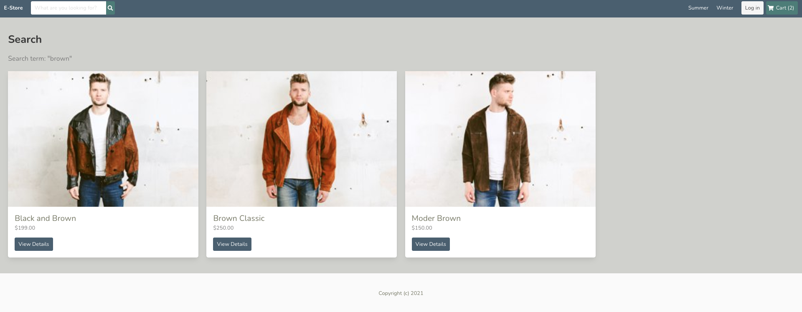
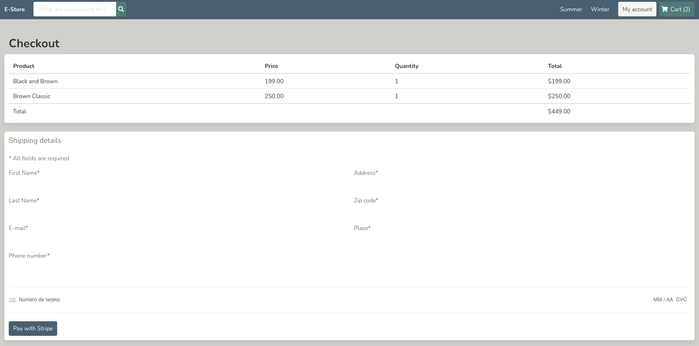

# Estore

> Based on [this tutorial](https://www.youtube.com/watch?v=Yg5zkd9nm6w)

This is a working example of a simple e-commerce website built with a Vue frontend and Django as a backend.

Landing Page:

Search products by keyword:

Cart view:

Checkout:
